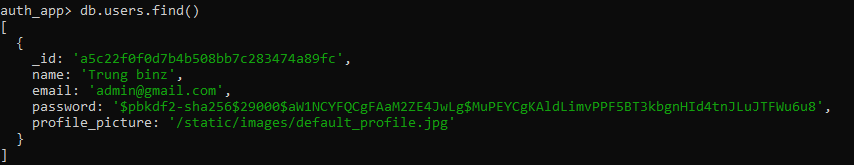
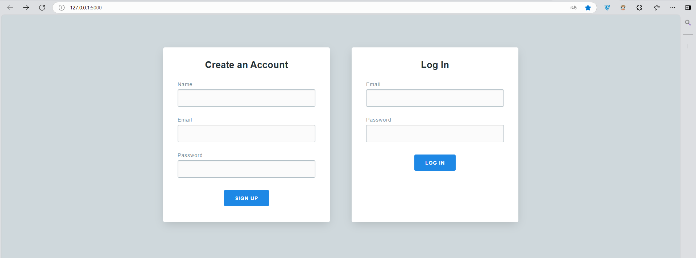
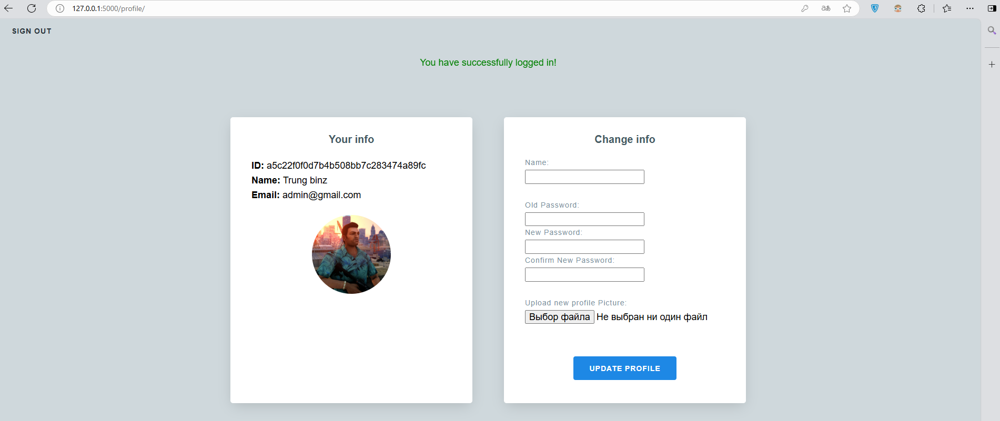
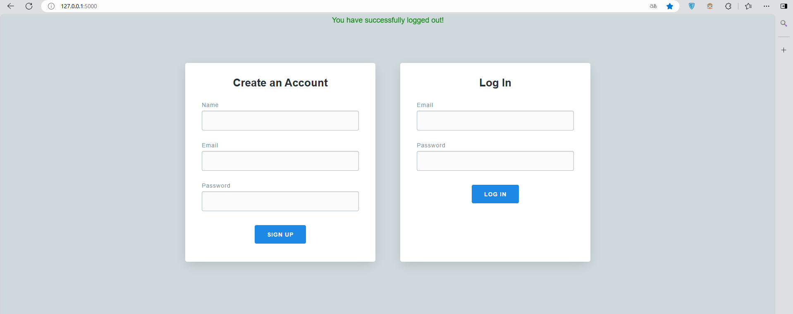
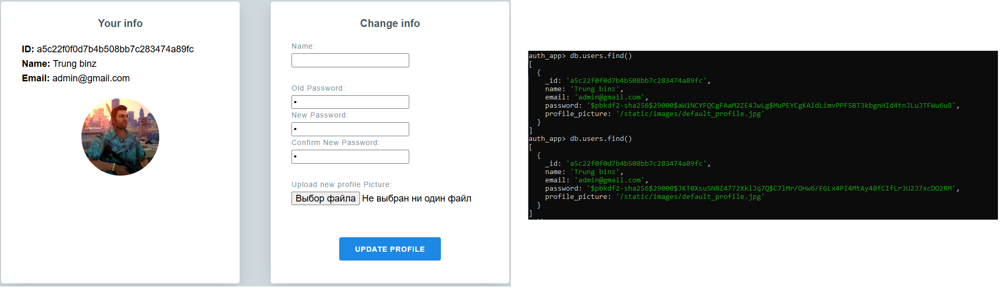
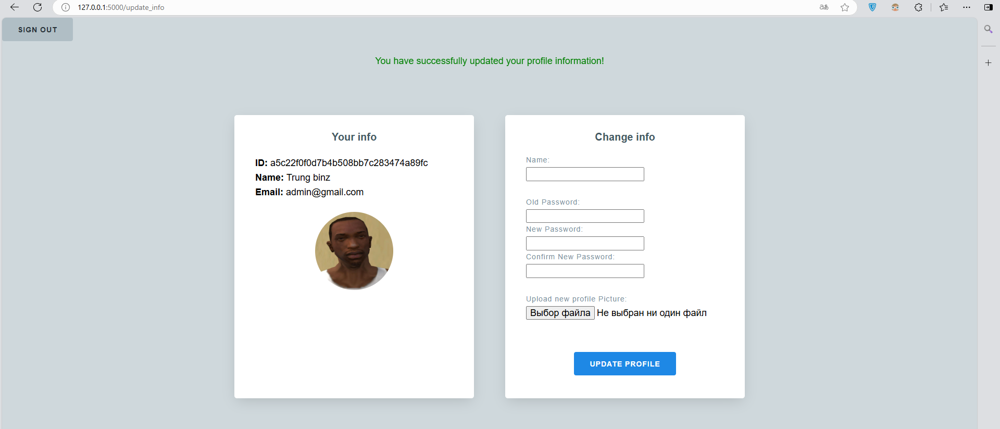
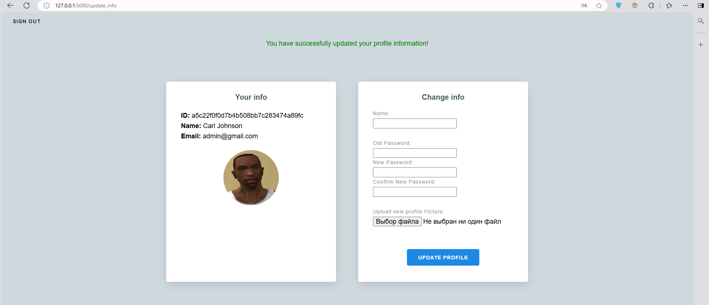
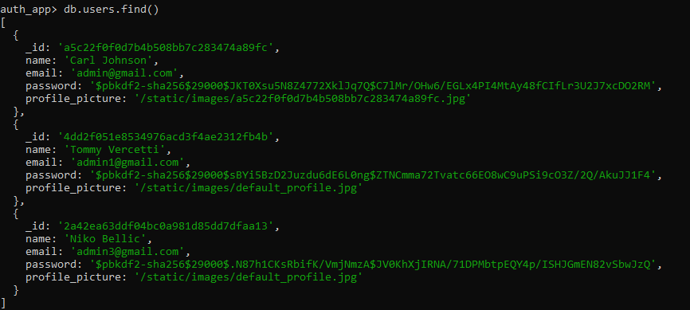
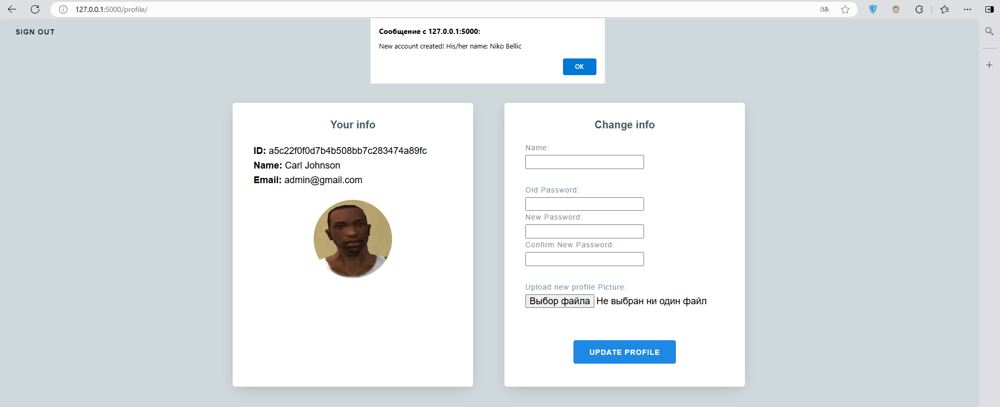
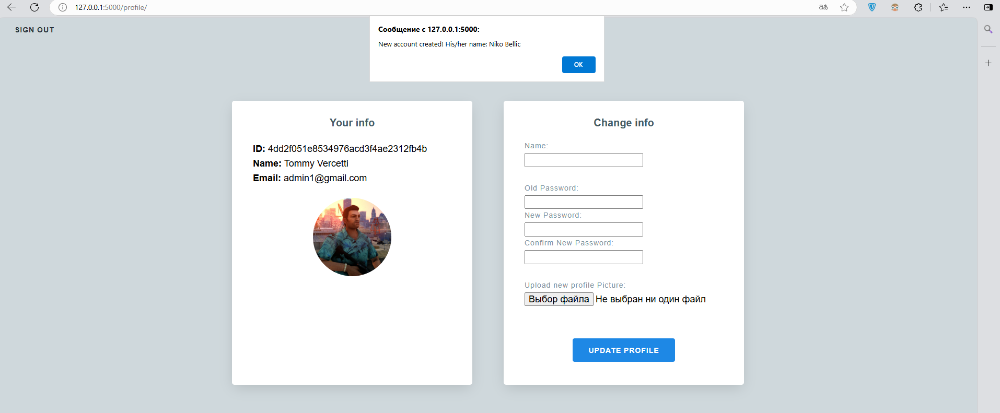

# HW2_WAD2025
The 2nd homework assigment\
**Basic part: Implement authentication feature**
- Listen on localhost:5000   
- Render authentication form at http://localhost:5000/   
- Redirect user to profile page if successfully authenticated   
- Show profile page for authenticated user only at http://localhost:5000/profile   
- User name and password are stored in Mongodb or Redis

**Advanced part (optional):**
- Implement feature that allows users to create new account, profile will be shown with data respected to each account.   
- Implement password hashing, logout and password change features   
- Allow users to update profile picture (new user will have a default profile picture)   
- Allow users to update profile information

**Challenging part (optional):**
- Implement notification, an active user will receive notification when a new account is created.

## FOLDER CONTENT
```bash
HW2_WAD2025/main\
|-- README.md
|-- app.py
|-- run
|-- static
|   |-- css
|   |   |-- normalize.css
|   |   `-- styles.css
|   |-- images
|   |   `-- default_profile.jpg
|   `-- js
|       |-- jquery.js
|       `-- scripts.js
|-- templates
    |-- base.html
    |-- home.html
    `-- profile.html
```
## HOW TO RUN
1. Requirements:
- Python 3.6 or higher (I used Python 3.13.2)
- pip (Python package installer)
2. Create a Virtual Environment
   ```bash
   python -m venv venv
   source venv/bin/activate  # on Windows use 'venv\Scripts\activate'
   ```
3. Install Required Packages
   ```bash
   pip install Flask pymongo passlib flask-socketio
   ```
4. Running the Application
   ```bash
   flask run # or './run'
   ```

## SCREENSHOTS
### 1. Basic parts
**1.1 Database**
<div align="center">
       
</div>

**1.2 Listen on localhost:5000, render authentication form at http://localhost:5000/**
<div align="center">
       
</div>

**1.3 Redirect user to profile page if successfully authenticated**
<div align="center">
       
</div>

**1.4 User name and password are stored in Mongodb or Redis**\
Picture 1.1

### 2. Advanced parts
**2.1 Implement feature that allows users to create new account, profile will be shown with data respected to each account**\
- Picture 1.2 - Form 'Create an Account'
- Picture 1.3 - Data of user

**2.2 Implement password hashing, logout and password change features**
- Picture 1.1 - Password hashing (pbkdf2_sha256)
- Logout (Picture 1.3 - Logout button):
<div align="center">
       
</div>

- Password change:
<div align="center">
       
</div>

**2.3 Allow users to update profile picture (new user will have a default profile picture)**\
<div align="center">
       
</div>

**2.4 Allow users to update profile information**
- Picture 2.2 - Change password
- Picture 2.3 - Change picture
- Change name:
<div align="center">
       
</div>


### 3. Challenging part:
Implement notification, an active user will receive notification when a new account is created.
- Database:
<div align="center">
       
</div>
- Active users receive notification:
<div align="center">
       
</div>
<div align="center">
       
</div>